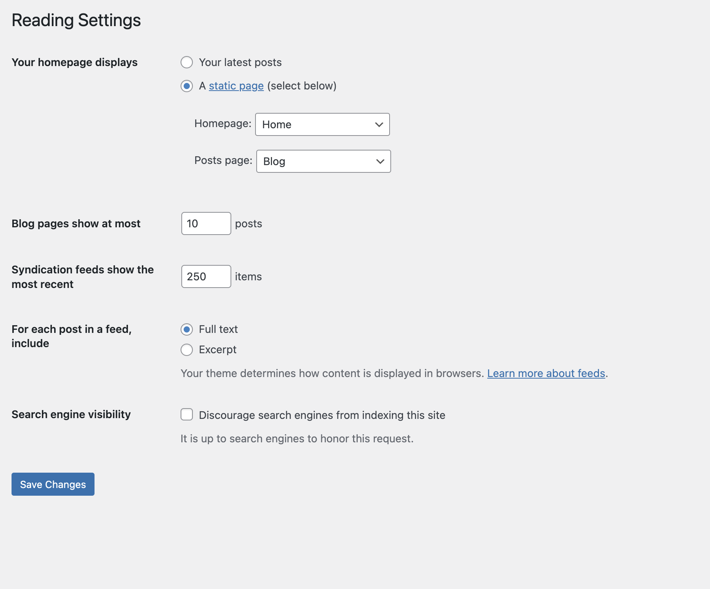

# WordPress Settings

In order for the Blog RSS feeds to work correctly, please make the following changes to your WordPress website.

## Reading Settings

Below are the following changes for Reading Settings:

- Increase "Syndication feeds show the most recent". This is normally set to 10. Significantly increase this number. Here you can see that we have set the number to 250 posts.
- Next, the "For each post in a feed, include", needs to be changed to "Full text". This will ensure that we get the entire article and not just the excerpt.

