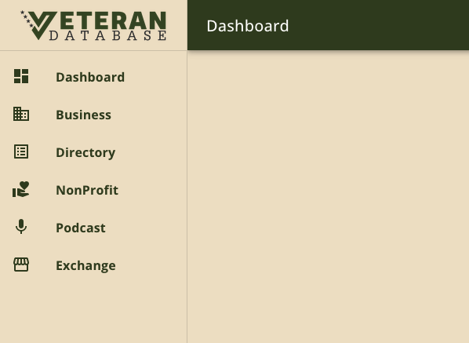
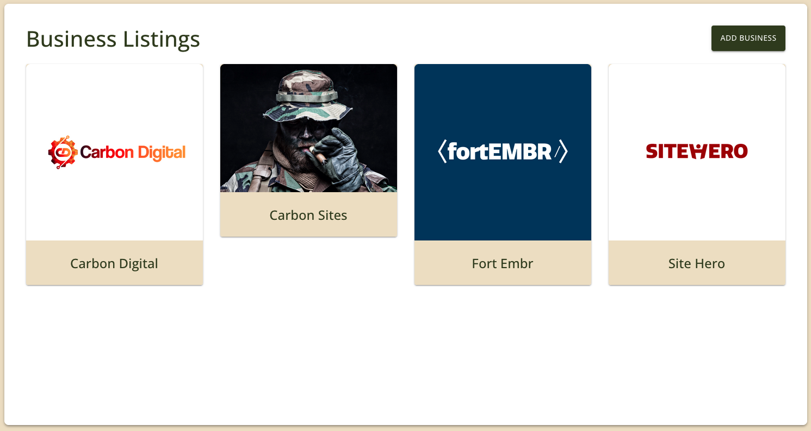
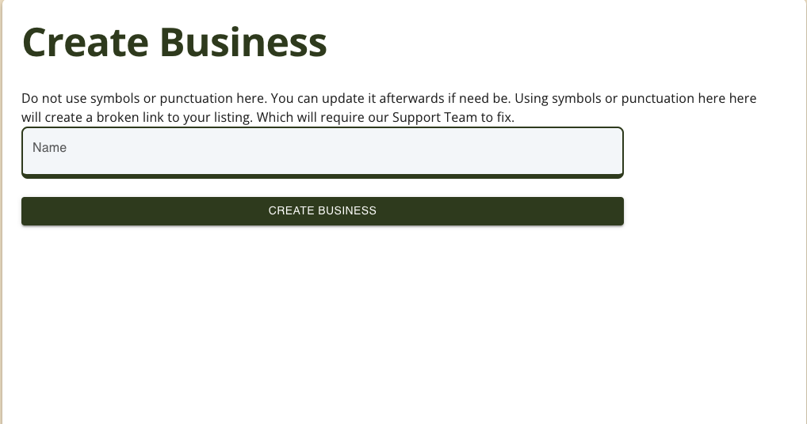

# Create Listing

Learn how to create a listing for each of our content modules.

## Content Modules

The logo is used in our content modules. Once you click on the Business, Directory, NonProfit or Podcast menu items, you will be taken to an archive page that shows all of your listings for each module.

## Module Archive Page

Here is an example of a Business page. This will list out all of the business listings that you have created in your account.

In the top-right corner, you will find a button that says "Add X". The "X" will change based on which module you are located in.

Click on this button to begin creating a new listing.

<strong>New Accounts: You will not have any listings present until you create them.</strong>

## Create New Listing

On the module archive page, you will click on the "Add X" button. Once you click on it, the page below will show up.

The name you enter here will get converted to a page slug. The only special characters that are used on a page slug are the "-" (dash) and "\_" (underscore) characters.

** Do&apos;s: **

- Use official name
- Use a social media handle

** Don&apos;ts: **

- Mix the listing name, listing service, or features of the listing.
  - Ex: "John Wick & Associates - Hotel Cleaners"
    - This should be either "John Wick & Associates" or "Hotel Cleaners", but not both.
  - Ex: "James Bond - Realtor &amp; Real Estate Influencer"
    - This should be either "James Bond", "Realtor" or "Real Estate Influencer", but not all three.
  - Ex: "Cowboy Leather - Made in the USA"
    - This should be just "Cowboy Leather".

