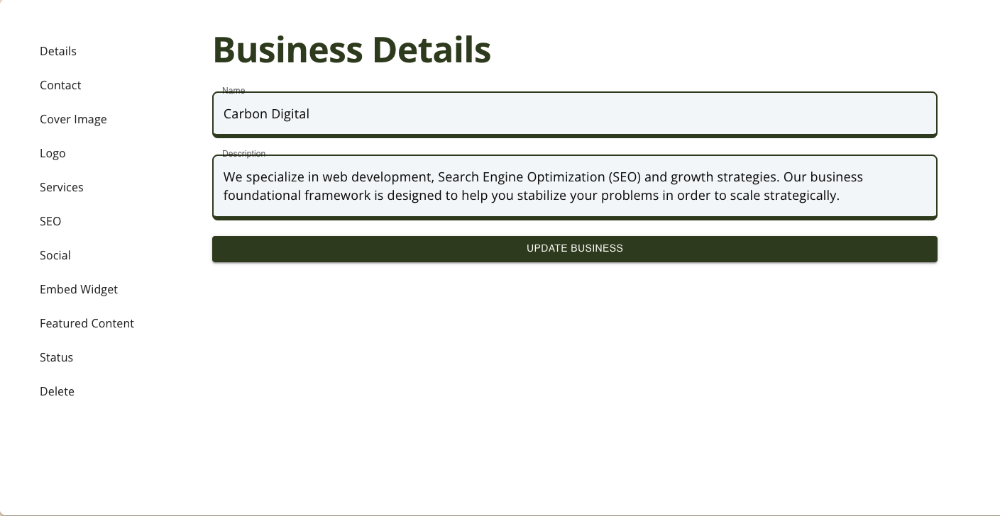
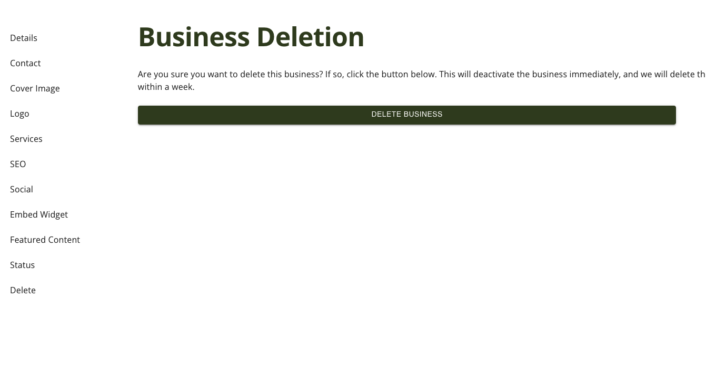

# Delete Listing

Learn how to delete your listings for the content modules.

## Listing Example

Here is an example of a listing.

### Sidebar

The list has a sub-page that includes a sidebar for the listing. Navigate to Delete.

### Delete Page

The business delete page gives you a place to request that your listing be deleted from the platform. Nothing gets deleted right away, as your status is changed from "active" to "inactive". We have automated scripts that use this to delete records from the database.

