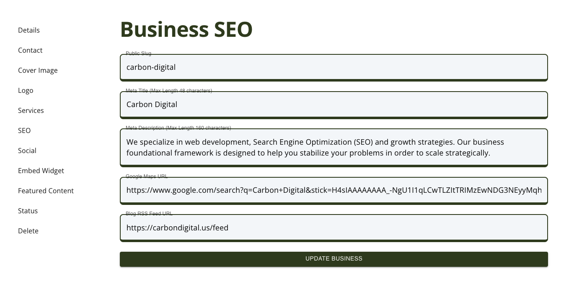

# Update Listing

Learn how to update your listings for the content modules.

## Listing Example

Here is an example of a listing.

### Sidebar

The list has a sub-page that includes a sidebar for the listing. These are different sections of content that can be edited for the listing itself. In this example, those listings are:

- Details
- Contact
- Cover Image
- Logo
- Services
- SEO
- Social
- Embed Widget
- Featured Content
- Status
- Delete

### Details Page

For the business details page, you can edit your:

- Name
- Description

### Contact Page

For the business contact page, you can edit your:

- Email
- Phone
- Website
- Address

### Cover Image Page

For the business cover image page, you can upload a cover image. Make sure to check the [file uploads section](/docs/category/file-uploads) for image specifications.

### Logo Page

For the business logo page, you can upload a logo. Make sure to check the [file uploads section](/docs/category/file-uploads) for image specifications.

### Services Page

On the services page, there are two main categories of content you can edit:

- Services List
- NAICS Codes

#### Update Services

You can add or delete a service, using the correcponding buttons for 'Add Service' and 'Delete Service'.
Each service can have the following details:

- Name
- Website Service Page URL
  - This would be the page on your website that details the service.
- Price
- Description

#### Update NAICS Codes

The NAICS Codes field was developed as a "tag" type system. You can search for the code number or title.

1. Add Code: Search and select.
2. Delete Code: Click the "tag" close button "X".

### SEO Page

For the business SEO page, you can update the following fields:

- Listing Slug
  - This will be the "page link" for your listing. It will show up as /business/{listing-slug}.
- Meta Title
  - This is the text that shows up in your browser tab.
- Meta Description
  - This is the text that shows up in the Search Engine Results Pages (SERPs).
- Google Maps URL
  - We will link this to your address, making it easier to open the maps.
- Blog RSS Feed URL
  - We can import your blog feed and add your blog content to our website. We also create backlinks to your website and the article.

### Social Page

For the business Social page, you can add social media profile links to the listing. We currently support:

- Dribbble
- Facebook
- GitHub
- Instagram
- LinkedIn
- Pinterest
- Snapchat
- TikTok
- Twitch
- Twitter
- YouTube
- Other

### Embed Widget Page

The business embed widget is a tool that allows each user to support the platform, and all users on the platform. The Embed Widget is a small piece of HTML code that you add to your website. When you do, two things will happen.

1. The VeteranDB logo will show up with the color that you chose.
2. The image will be wrapped in a link that, once clicked, will take a visitor to your listing page on the public website.

The color options for the VeteranDB logo are below. Simply pick the color that best matches your brand.

- Black
- Dark (black and green)
- Light (white and cream)
- White

Where do you place this code?

- The best place for tihs code is your website footer. This will ensure that the link is added to every page on your website.

What does that do?

- Placing a backlink in your footer will elevate the SEO status for VeteranDB. As we are elevated, we also elevate all users on the platform. Pulling them up with us.

### Featured Content Page

The business featured content page lets you know if your listing is featured. There is also a button that takes you to the form, where you can request for your listing to be featured.

### Status Page

The business status page lets you know if your listing is "active", or visible on the platform.

